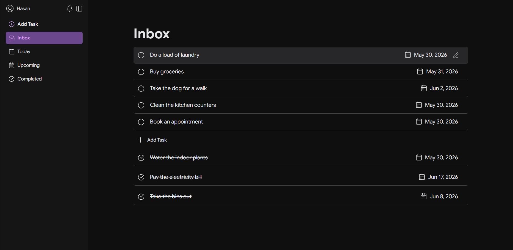
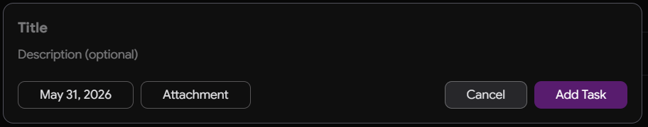
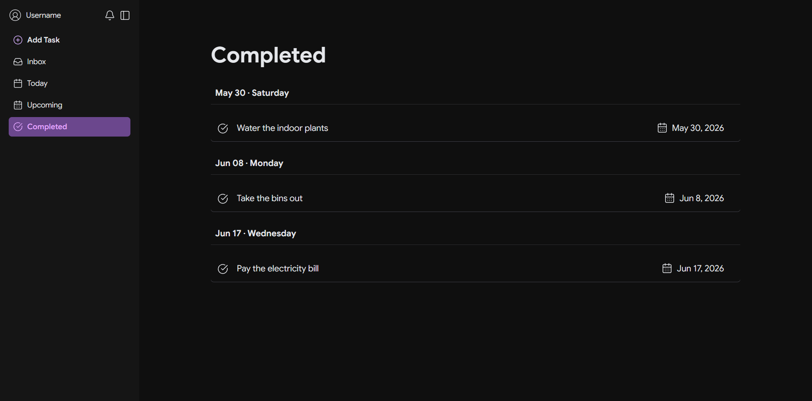
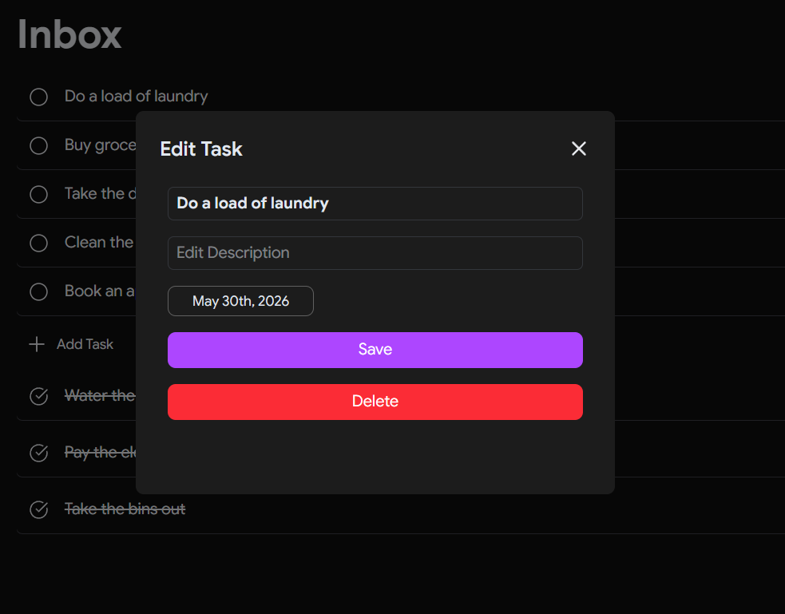

# Todoish

A task management application developed using React, TypeScript, and Tailwind CSS. It provides a structured interface for organising daily activities.

## Screenshots









## Features and Status

Please note that this project is currently in development. At present, only the following functionality is active:
* **Add Task:** Interface for creating new entries.
* **Current Tasks:** View active and pending tasks.
* **Completed Tasks:** View finished tasks.

All other tabs are currently non-functional placeholders.

## Technologies Used

* **Frontend:** React, TypeScript
* **Build Tool:** Vite
* **Styling:** Tailwind CSS

## Installation

Clone the repository and run the following commands to start the local development server:

```bash
npm install
npm run dev